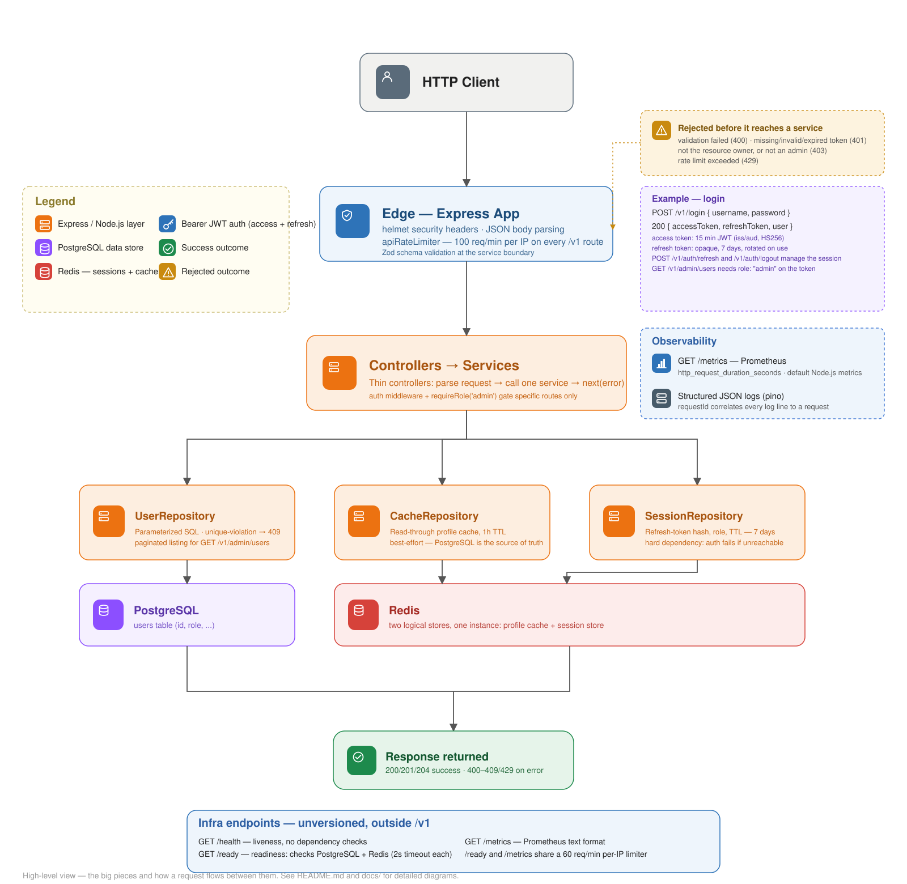
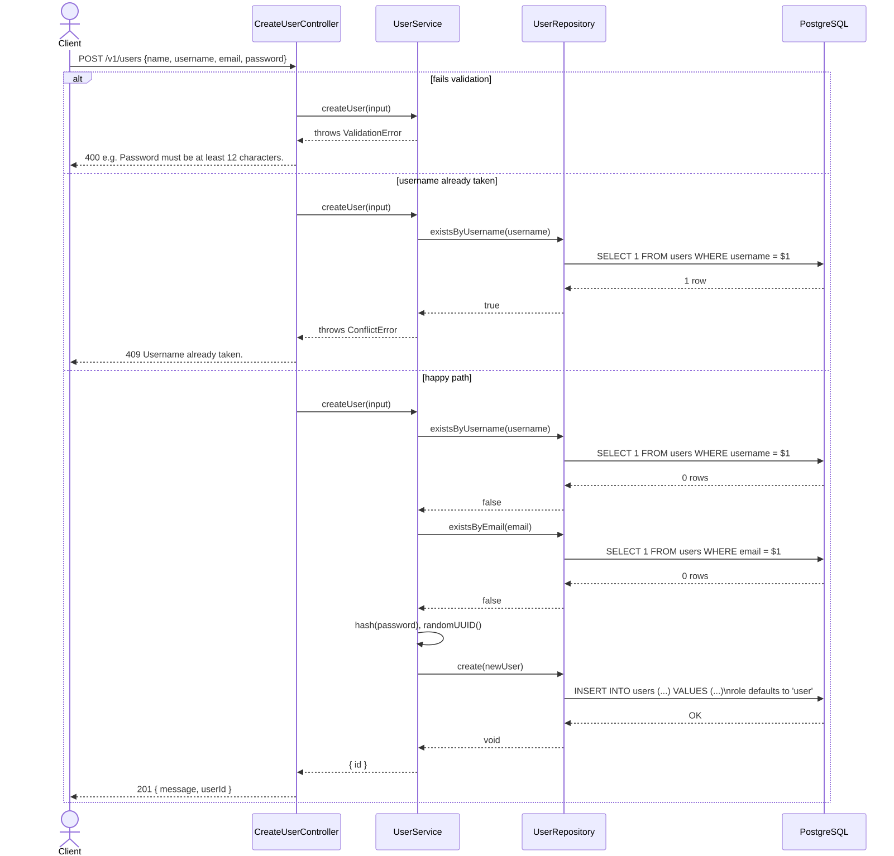
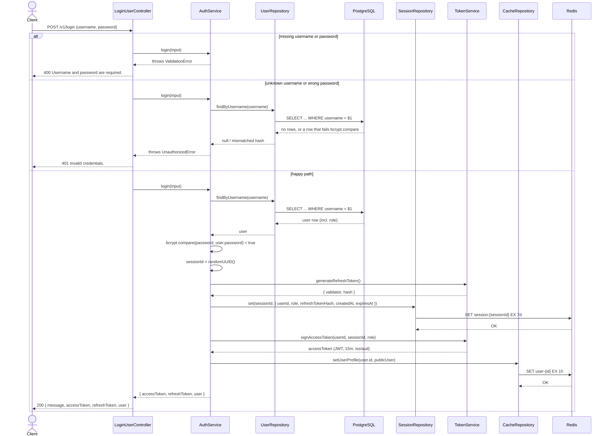

# Node.js + Redis + PostgreSQL REST API

JWT-authenticated REST API built with Node.js, Express 5 and TypeScript.

PostgreSQL is the source of truth, while Redis is used for:

- authentication sessions and refresh-token rotation
- read-through profile caching

Includes RBAC, distributed rate limiting, structured logging, Prometheus metrics, health/readiness checks, Docker and a multi-layer test suite.

[](https://github.com/luizcurti/jwt-redis-session-api/actions/workflows/ci.yml)


[](LICENSE)

---

## Highlights

- JWT access tokens (15 min) + Redis-backed sessions with **instant** revocation
- Refresh-token rotation with **reuse detection** — a replayed token kills the whole session
- Role-based access control (RBAC), embedded in the token, zero extra DB round trips
- Distributed rate limiting — Redis-backed, holds across multiple app replicas
- Structured JSON logging (pino) with request correlation
- Prometheus metrics (`/metrics`), liveness/readiness probes (`/health`, `/ready`)
- Docker: multi-stage, non-root, read-only filesystem + Docker Compose
- **100% test coverage** — unit, integration, e2e and Postman/Newman tiers
- CI: lint, typecheck, full test suite, CodeQL, Trivy, containerized validation

---

## Architecture



```
Client
  │
  ▼
Express Router (composition root: routes.ts), mounted under /v1
  │
  └── apiRateLimiter (100 req/min per IP, every /v1 route)
        │
        ├── POST /v1/users              → CreateUserController   → UserService → UserRepository (PostgreSQL)
        ├── POST /v1/login               → own rate limiter → LoginUserController    → AuthService  → UserRepository + CacheRepository + SessionRepository + TokenService
        ├── POST /v1/auth/refresh        → own rate limiter → RefreshTokenController → AuthService  → SessionRepository + TokenService
        ├── POST /v1/auth/logout         → auth middleware → LogoutController → AuthService → SessionRepository
        ├── GET  /v1/users/profile/:id   → auth middleware → GetUserInfoController → UserService → CacheRepository (Redis) → UserRepository (PostgreSQL, on a cache miss)
        └── GET  /v1/admin/users         → auth middleware → requireRole('admin') → ListUsersController → UserService → UserRepository (paginated)
```

- Constructor-based dependency injection
- Single composition root (`src/routes.ts`) — every collaborator is built once there and wired in
- Thin controllers — parse the request, call one service, forward errors via `next(error)`
- Services own the business rules (validation, hashing, ownership checks, session lifecycle, caching)
- Repositories isolate infrastructure — the only code that talks to `pg`/`ioredis` directly

See [docs/architecture.md](docs/architecture.md) for the database schema, migrations, and the full layering rationale, and [docs/](docs/) for every diagram — including a component-level breakdown (`docs/img/architecture.svg`) one level more detailed than the system overview above.

---

## Key Design Decisions

### JWT + Redis sessions

JWT provides stateless token verification, while Redis provides server-side session state and immediate revocation. Neither alone gets you both properties.

### Opaque refresh tokens

Refresh tokens are random opaque values (`sessionId.validator`), not JWTs. Only their SHA-256 hash is stored in Redis — the raw validator exists only in the token handed to the client.

### Two Redis stores

Session state (`SessionRepository`) and profile caching (`CacheRepository`) are separate repositories because they have different reliability requirements: authentication fails loudly if Redis is unreachable, while the cache falls back to PostgreSQL.

### PostgreSQL as the source of truth

Redis is never the source of truth for user data. A profile cache miss — or Redis being unreachable entirely — falls back to PostgreSQL and repopulates the cache.

### No ORM

The project uses parameterized SQL through `pg` to keep database access explicit and demonstrate direct PostgreSQL usage: parameterized queries, named constraints, and plain SQL migrations.

### Trade-offs

| Decision                              | Trade-off                                                                             |
| -------------------------------------- | --------------------------------------------------------------------------------------- |
| JWT + Redis                           | Extra Redis dependency, but immediate revocation                                     |
| Role embedded in the JWT               | No DB lookup per request, but a role change only takes effect on the next login      |
| Refresh-token rotation                | Strong replay protection, but a reused (stolen or already-rotated) token kills the session |
| Redis profile cache                   | Lower PostgreSQL load, but adds cache-invalidation/TTL complexity                     |
| Raw SQL, no ORM                       | Full control over queries and constraints, but more SQL to maintain by hand          |
| Short-lived access tokens (15 min)    | Smaller compromise window, but every client needs a working refresh flow             |

---

## Security

- Short-lived JWT access tokens (15 min), explicit `issuer`/`audience`/`algorithms` checks
- Rotating opaque refresh tokens (7 days)
- Refresh-token reuse detection — a replayed token deletes the whole session
- Redis-backed session revocation (instant logout)
- Role-based access control (RBAC)
- Distributed, Redis-backed rate limiting (per-IP, per-username, and a baseline on every route)
- bcrypt password hashing (12 salt rounds)
- Parameterized SQL — no string-built queries
- Helmet security headers, global Content-Security-Policy
- Input validation with Zod
- Security scanning in CI (CodeQL + Trivy)

See [docs/security.md](docs/security.md) for implementation details and trade-offs.

---

## Tech Stack

| Layer             | Technology                                              |
| ------------------ | --------------------------------------------------------- |
| Runtime           | Node.js 24 + TypeScript 5.9 (strict mode)               |
| Framework         | Express 5                                               |
| Database          | PostgreSQL 15                                           |
| Cache / Sessions  | Redis 7 (ioredis) — see [Authentication Flow](#authentication-flow) |
| Auth              | JWT access tokens (15 min) + opaque refresh tokens (7 days) |
| Authorization     | RBAC (`user` \| `admin`)                                |
| Passwords         | bcryptjs (12 salt rounds)                               |
| Security headers  | Helmet, global CSP                                      |
| Rate limiting     | Redis-backed, layered — see [Security](#security)       |
| API docs          | OpenAPI 3.0 / Swagger UI at `/docs`                      |
| Observability     | pino structured logs, Prometheus `/metrics`             |
| Testing           | Jest, Supertest, Newman (Postman)                       |
| Containers        | Docker (multi-stage, non-root) + Docker Compose         |

> TypeScript is pinned to `5.9.x` for compatibility with the current ESLint/Jest toolchain — see [docs/technical-notes.md](docs/technical-notes.md).

---

## Quick Start

### Requirements

- [Docker](https://www.docker.com/) and Docker Compose
- Node.js 24+ (only needed for local development without Docker)

### Run with Docker

```bash
git clone https://github.com/luizcurti/jwt-redis-session-api.git
cd jwt-redis-session-api
cp .env.example .env

docker compose up --build
```

- API: <http://localhost:3000>
- Swagger UI: <http://localhost:3000/docs>
- Health: <http://localhost:3000/health>

Stop and remove everything, including the database volume:

```bash
docker compose down -v
```

> `JWT_SECRET` in `.env` must be at least 32 characters — `docker compose up` fails fast with a clear error otherwise. Generate one with `openssl rand -base64 48`. See [Docker & CI/CD](#docker--cicd) for the full hardening checklist.

### Run locally without Docker

Make sure PostgreSQL and Redis are running and reachable at the hosts/ports in `.env`, then:

```bash
npm install
npm run migrate
npm run dev
```

### Available scripts

| Script                           | Description                                                                                                                |
| --------------------------------- | ----------------------------------------------------------------------------------------------------------------------------- |
| `npm run dev`                    | Start development server with hot reload (tsx watch)                                                                       |
| `npm start`                      | Start production server (tsx)                                                                                              |
| `npm run build`                  | Compile TypeScript to JavaScript                                                                                           |
| `npm run migrate`                | Apply all pending PostgreSQL migrations                                                                                    |
| `npm run migrate:down`           | Roll back the most recently applied migration                                                                              |
| `npm run migrate:create <name>`  | Scaffold a new migration file                                                                                              |
| `npm test`                       | Run unit tests (no external services required)                                                                             |
| `npm run test:integration`       | Run integration tests against real PostgreSQL + Redis                                                                      |
| `npm run test:e2e`               | Run end-to-end tests (real HTTP requests, real infra)                                                                      |
| `npm run test:all`               | Run unit + integration + e2e tests                                                                                         |
| `npm run test:collection`        | Run the Postman collection with Newman against a running instance (`COLLECTION_BASE_URL`, default `http://localhost:3000`) |
| `npm run coverage`               | Run unit tests with a coverage report                                                                                      |
| `npm run coverage:all`           | Run all test tiers with a coverage report                                                                                  |
| `npm run audit`                  | Check production dependencies for known high/critical vulnerabilities                                                      |
| `npm run lint`                   | Run ESLint                                                                                                                 |
| `npm run lint:fix`               | Run ESLint with automatic fixes                                                                                            |
| `npm run format`                 | Format code with Prettier                                                                                                  |
| `npm run format:check`           | Check if code is properly formatted                                                                                        |

---

## API Endpoints

Full interactive documentation (OpenAPI/Swagger UI) is served at **`/docs`** once the server is running. Every business endpoint lives under `/v1`; `/`, `/health`, `/ready`, `/metrics`, and `/docs` are deliberately unversioned infra/meta endpoints.

| Method | Endpoint                  | Auth           | Description                    |
| ------ | -------------------------- | --------------- | ------------------------------- |
| POST   | `/v1/users`                | —               | Create a user                  |
| POST   | `/v1/login`                | —               | Authenticate, issue tokens     |
| POST   | `/v1/auth/refresh`         | Refresh token  | Rotate access/refresh tokens   |
| POST   | `/v1/auth/logout`          | Bearer         | Revoke the current session     |
| GET    | `/v1/users/profile/:id`    | Bearer         | Get the caller's own profile   |
| GET    | `/v1/admin/users`          | Bearer (admin) | List users, paginated          |
| GET    | `/health`                  | —               | Liveness probe                 |
| GET    | `/ready`                   | —               | Readiness probe (PostgreSQL + Redis) |
| GET    | `/metrics`                 | —               | Prometheus metrics             |

### `POST /v1/users` — Create a new user



**Request body:**

```json
{
  "name": "newname",
  "username": "newuser",
  "email": "newuser@example.com",
  "password": "a-strong-password-123"
}
```

Validated with [Zod](https://zod.dev) (`src/services/UserService.ts`), not just a truthy-field check:

| Field      | Rule                                                                                                                                                                    |
| ---------- | ----------------------------------------------------------------------------------------------------------------------------------------------------------------------- |
| `username` | 3–30 characters, trimmed                                                                                                                                                |
| `name`     | 2–100 characters, trimmed                                                                                                                                               |
| `email`    | valid email format, trimmed, lowercased before storage/uniqueness checks                                                                                                |
| `password` | 12–72 characters (capped at 72 — bcrypt silently truncates anything longer, so a longer password would be accepted but silently hashed on only its first 72 characters) |

**Responses:**

| Status                      | Body                                                                                                                                                                                                                      |
| ---------------------------- | ----------------------------------------------------------------------------------------------------------------------------------------------------------------------------------------------------------------------- |
| `201 Created`                | `{ "message": "User created successfully", "userId": "<uuid>" }`                                                                                                                                                          |
| `400 Bad Request`            | `{ "error": "..." }` — the first failing field's message, e.g. `"Name is required."`, `"Username must be at least 3 characters."`, `"Email must be a valid email address."`, `"Password must be at least 12 characters."` |
| `409 Conflict`                | `{ "error": "Username already taken." }` or `{ "error": "Email already registered." }` — enforced by the database's `UNIQUE` constraints, not just the pre-check                                                        |
| `429 Too Many Requests`      | `{ "error": "Too many requests. Please try again later." }`                                                                                                                                                               |
| `500 Internal Server Error`  | `{ "error": "Internal server error." }`                                                                                                                                                                                   |

> **Note:** `UserService.createUser` checks `existsByUsername`/`existsByEmail` first for a fast, friendly conflict response in the common case, but that check-then-insert has an inherent race window under concurrent requests. The actual guarantee is the `UNIQUE` constraint applied by `migrations/1789124363743_create-users.sql`; `UserRepository.create` catches a Postgres unique-violation (`23505`) and translates it into the same `ConflictError`, so a race between two concurrent signups for the same username still resolves to a clean `409`, not a `500`. See [docs/architecture.md](docs/architecture.md#database-schema).

---

### `POST /v1/login` — Authenticate a user



**Request body:**

```json
{
  "username": "newuser",
  "password": "newpassword"
}
```

**Responses:**

| Status                       | Body                                                                                                                                                                                                                                                       |
| ------------------------------ | ------------------------------------------------------------------------------------------------------------------------------------------------------------------------------------------------------------------------------------------------------- |
| `200 OK`                     | `{ "message": "Login successful", "accessToken": "<jwt, 15 min>", "refreshToken": "<sessionId>.<validator>, 7 days", "user": { "id", "name", "username", "email", "role" } }`                                                                              |
| `400 Bad Request`            | `{ "error": "Username and password are required." }`                                                                                                                                                                                                       |
| `401 Unauthorized`           | `{ "error": "Invalid credentials." }`                                                                                                                                                                                                                      |
| `429 Too Many Requests`      | `{ "error": "Too many login attempts. Please try again later." }` _(>10 requests/15 min per IP)_, or `{ "error": "Too many login attempts for this account. Please try again later." }` _(>10 requests/15 min per normalized username, independent of IP)_ |
| `500 Internal Server Error`  | `{ "error": "Internal server error." }`                                                                                                                                                                                                                    |

---

### `POST /v1/auth/refresh` — Rotate an access/refresh token pair

**Request body:**

```json
{ "refreshToken": "<sessionId>.<validator>" }
```

**Responses:**

| Status                    | Body                                                                                                                                              |
| --------------------------- | ------------------------------------------------------------------------------------------------------------------------------------------------- |
| `200 OK`                  | `{ "message": "Token refreshed successfully", "accessToken": "<jwt>", "refreshToken": "<new sessionId>.<new validator>" }`                        |
| `400 Bad Request`         | `{ "error": "Refresh token is required." }`                                                                                                       |
| `401 Unauthorized`        | `{ "error": "Invalid refresh token." }` _(malformed, unknown, expired, or already-used — reusing a rotated-away token deletes the whole session)_ |
| `429 Too Many Requests`   | `{ "error": "Too many refresh attempts. Please try again later." }`                                                                               |

> **Note:** The refresh token returned here replaces the one used in the request — the old one stops working immediately (rotation). See [Authentication Flow](#authentication-flow).

---

### `POST /v1/auth/logout` — Revoke the current session (requires JWT)

**Header:**

```
Authorization: Bearer <accessToken>
```

**Responses:**

| Status              | Body                                                                                                           |
| -------------------- | ----------------------------------------------------------------------------------------------------------------- |
| `200 OK`            | `{ "message": "Logout successful" }`                                                                           |
| `401 Unauthorized`  | `{ "error": "Token missing" }`, `{ "error": "Invalid token" }`, or `{ "error": "Session expired or revoked" }` |
| `429 Too Many Requests` | `{ "error": "Too many requests. Please try again later." }`                                                 |

> **Note:** This deletes the session from Redis. The access token used to call this endpoint (and any other access token issued for the same session) is rejected on its very next use — even though it hasn't expired yet.

---

### `GET /v1/users/profile/:id` — Get user profile (requires JWT)


**Header:**

```
Authorization: Bearer <accessToken>
```

**Responses:**

| Status                       | Body                                                                                                                                                                                                                                  |
| ------------------------------ | ------------------------------------------------------------------------------------------------------------------------------------------------------------------------------------------------------------------------------------- |
| `200 OK`                     | `{ "id", "name", "username", "email", "role" }`                                                                                                                                                                                       |
| `401 Unauthorized`           | `{ "error": "Token missing" }`, `{ "error": "Invalid token" }`, or `{ "error": "Session expired or revoked" }` _(a validly-signed but logged-out/expired session — see [Authentication Flow](#authentication-flow))_                  |
| `403 Forbidden`              | `{ "error": "You are not allowed to access this profile." }` _(`:id` does not match the authenticated user)_                                                                                                                          |
| `404 Not Found`              | `{ "error": "User not found." }` _(the user genuinely doesn't exist in PostgreSQL — e.g. the account was deleted)_                                                                                                                    |
| `429 Too Many Requests`      | `{ "error": "Too many requests. Please try again later." }`                                                                                                                                                                           |
| `500 Internal Server Error`  | `{ "error": "Internal server error." }`                                                                                                                                                                                               |

> **Note:** True read-through cache: a Redis hit returns the profile straight from Redis, no PostgreSQL round-trip. A Redis miss (cache expired, never populated, or Redis itself unreachable) falls back to PostgreSQL, repopulates the cache, and returns the profile — Redis being unavailable degrades this endpoint's latency, not its availability. The cache repopulation write is best-effort: if it fails, the response still succeeds. Only returns the caller's own profile (`:id` must match the authenticated user).

---

### `GET /v1/admin/users` — List all users, paginated (requires admin role)

See [Authentication Flow](#authentication-flow) for how a user becomes an admin.

**Header:**

```
Authorization: Bearer <accessToken>
```

**Query parameters:**

| Param    | Default | Range |
| -------- | ------- | ----- |
| `limit`  | 20      | 1–100 |
| `offset` | 0       | 0+    |

**Responses:**

| Status                       | Body                                                                                                           |
| ------------------------------ | ----------------------------------------------------------------------------------------------------------------- |
| `200 OK`                     | `{ "items": [{ "id", "name", "username", "email", "role" }, ...], "total", "limit", "offset" }`                |
| `400 Bad Request`            | `{ "error": "limit must be a number." }` (or the equivalent for whichever param/rule failed)                   |
| `401 Unauthorized`           | `{ "error": "Token missing" }`, `{ "error": "Invalid token" }`, or `{ "error": "Session expired or revoked" }` |
| `403 Forbidden`               | `{ "error": "You do not have access to this resource." }` _(authenticated, but `role !== 'admin'`)_            |
| `429 Too Many Requests`      | `{ "error": "Too many requests. Please try again later." }`                                                    |
| `500 Internal Server Error`  | `{ "error": "Internal server error." }`                                                                        |

### `GET /health`, `GET /ready`, `GET /metrics`

No auth on any of these. `/health` does no dependency work and isn't rate-limited; `/ready` and `/metrics` each do real work (a Postgres/Redis round trip, serializing the metrics registry), so both sit behind a 60-requests-per-minute-per-IP limiter. See [Observability](#observability).

| Endpoint       | `200`                                 | `429`                                  | `503`                                                       |
| -------------- | -------------------------------------- | ---------------------------------------- | ----------------------------------------------------------- |
| `GET /health`  | `{ "status": "ok" }`                  | _(never — not rate-limited)_           | _(never — always 200 if the process can respond at all)_    |
| `GET /ready`   | `{ "postgres": "ok", "redis": "ok" }` | `{ "error": "Too many requests..." }`  | `{ "postgres": "ok" \| "error", "redis": "ok" \| "error" }` |
| `GET /metrics` | Prometheus text-format metrics        | `{ "error": "Too many requests..." }`  | _(never)_                                                   |

---

## Authentication Flow

Authentication uses two token types, both backed by Redis:

- **Access token** — a JWT, 15 minutes, payload `{ sub: userId, sid: sessionId }`. Verified statelessly (signature + expiry) _and_ checked against Redis on every authenticated request: the auth middleware (`src/middleware/auth.ts`) does `sessionRepository.get(sessionId)` after verifying the signature, and rejects with `401` if the session is gone — even if the JWT itself is still validly signed and unexpired. This is what makes logout **instant** instead of "eventually, once the token expires."
- **Refresh token** — not a JWT. It's a **selector/validator split token**, the same family as Laravel Sanctum "remember me" tokens: `${sessionId}.${validator}`, where `validator` is 32 random bytes. The server splits on the first `.` to look up `session:{sessionId}` in Redis directly (O(1), no table scan, no reverse index), then compares `sha256(validator)` against the stored `refreshTokenHash` with a timing-safe comparison. Only the hash is ever persisted — the raw validator exists only in the token handed to the client.
- **Rotation** — every `POST /v1/auth/refresh` call invalidates the refresh token it was given and issues a brand-new one (same `sessionId`, new validator/hash), sliding the session's Redis TTL forward another 7 days.
- **Reuse detection** — if a refresh token's `sessionId` resolves to a real session but its validator doesn't match the stored hash, that's treated as evidence the token was stolen and already used once (by an attacker, or by the legitimate client racing itself). Rather than just rejecting that one request, the **entire session is deleted**, forcing a full re-login.
- **Logout** (`POST /v1/auth/logout`) simply deletes the session from Redis. Idempotent — logging out twice before the access token's own 15-minute expiry just succeeds both times.

```
POST /v1/login
  │
  ├─▶ access token  (JWT, 15 min)   ─┐
  └─▶ refresh token (opaque, 7 days) ┴─▶ Redis: session:{sessionId} → { userId, role, refreshTokenHash, createdAt, expiresAt }

POST /v1/auth/refresh { refreshToken }  → rotates both tokens, resets the session TTL
POST /v1/auth/logout   (Bearer <access>) → deletes session:{sessionId} → every future request with that access token now gets 401
```

### Roles & Access Control

Every user has a `role` — `user` (default) or `admin` — stored as a `TEXT` column with a `CHECK` constraint in PostgreSQL (`migrations/..._add-role-to-users.sql`). It's embedded in the access token's payload at login time (`{ sub, sid, role }`) and in the session record in Redis, so `requireRole('admin')` (`src/middleware/rbac.ts`) is a pure claim check on every request — no extra PostgreSQL or Redis round trip beyond the session lookup `authentication` already does.

```
GET /v1/admin/users
  │
  ▼
authentication  → verifies the JWT, checks the session exists in Redis, sets request.userRole
  │
  ▼
requireRole('admin')  → 403 unless request.userRole === 'admin'
  │
  ▼
ListUsersController → UserService.listUsers → UserRepository.listPaginated (LIMIT/OFFSET + COUNT(*))
```

- **Becoming an admin is deliberately not self-service.** `POST /v1/users` (public signup) has no `role` field in its request schema, and `UserRepository.create()`'s SQL has no `role` column in its `INSERT` at all — there's no code path through which a signup request body can influence a user's role, not just a validation rule that happens to reject it. The only way to promote a user today is a direct database statement:
  ```sql
  UPDATE users SET role = 'admin' WHERE username = 'your-username';
  ```
- **A role change takes effect on the user's _next_ login, not immediately.** The role is denormalized into the JWT and the Redis session at login time and stays fixed for that session's lifetime — the same trade-off the rest of the session data already makes. `POST /v1/auth/refresh` rotates the tokens but carries the role forward from the _existing_ session, not a fresh PostgreSQL lookup, so refreshing doesn't pick up a mid-session promotion either. This is covered explicitly by both an integration test and an e2e test (`AuthService.integration.test.ts`, `app.e2e.test.ts`) that promote a user mid-session and assert the _old_ role is still what's enforced.
- **`GET /v1/admin/users`** is the one endpoint gated by this today — lists all users, paginated (`?limit=` 1–100, default 20; `?offset=`, default 0), returning `{ items, total, limit, offset }`. It's also the only endpoint that returns more than one user's data or supports pagination, so it doubles as the demonstration for both.

---

## Testing

Four tiers, each covering the happy path and the sad paths (validation, auth, ownership, and not-found errors) for every endpoint — the same pyramid a team would actually want in CI, not just a single fast suite:

- **`src/__tests__/unit/`** — mocks every external dependency (PostgreSQL, Redis, bcrypt, JWT); no infrastructure required, runs in a couple of seconds.
- **`src/__tests__/integration/`** — exercises repositories and services against a real PostgreSQL and Redis instance.
- **`src/__tests__/e2e/`** — exercises the real Express app end-to-end via Supertest, with no mocks, against real infrastructure.
- **`Node Redis API.postman_collection.json`** — black-box HTTP tests via [Newman](https://github.com/postmanlabs/newman), run against a live instance of the built app (Docker or `npm start`) — the same collection CI runs against the actual containerized image.

```bash
npm test                    # unit only — no setup needed
docker-compose up -d postgres redis
npm run migrate
npm run test:integration
npm run test:e2e
npm run coverage:all        # unit + integration + e2e, with a coverage report

docker-compose up -d        # or `npm run build && npm start` with Postgres/Redis reachable
npm run test:collection     # Postman collection via Newman
```

```
Test Suites: 29 passed
Tests:       211 passed
Coverage:    100% statements / branches / functions / lines
```

See [docs/testing.md](docs/testing.md) for the specific edge cases covered beyond the happy/sad matrix (JWT algorithm-confusion, Redis failure modes, concurrency/race conditions, RBAC staleness).

---

## Observability

- Structured JSON logging with Pino
- Request correlation via `X-Request-Id`
- `/health` — liveness probe
- `/ready` — PostgreSQL + Redis readiness probe
- `/metrics` — Prometheus metrics
- Graceful `SIGTERM`/`SIGINT` shutdown

See [docs/observability.md](docs/observability.md) for the log shape, the health-check semantics, and the graceful-shutdown/pool-error details.

---

## Docker & CI/CD

### Docker hardening checklist

What's applied, and what's deliberately out of scope:

- **Non-root user**: the runtime image runs as `USER node`, not root (`Dockerfile`).
- **Multi-stage build, explicit production target**: `docker-compose.yml` builds `app`/`migrate` with `target: runtime` explicitly rather than relying on "last stage wins" — the `build` stage (with dev dependencies and the TypeScript compiler) never ships. `ENV NODE_ENV=production` is set in that runtime stage.
- **Container healthcheck**: the image has a `HEALTHCHECK` hitting `GET /health` via Node's own `http` module (no curl/wget added just for this) — `docker ps` shows `healthy`/`unhealthy`. The one-shot `migrate` service inherits the same image but disables it (`healthcheck: disable: true`) — it never listens on a port, so there's nothing to probe.
- **Read-only root filesystem**: `app` and `migrate` run with `read_only: true` plus a `tmpfs` mount for `/tmp` (verified: writes to `/app` fail with `EROFS`, writes to `/tmp` succeed). **Not** applied to the official `postgres`/`redis` images — they have real, version-specific writable-path requirements that are riskier to get right than the win is worth here.
- **Resource limits**: `deploy.resources.limits` (cpus/memory) on every service, verified enforced by plain `docker compose up`. The values are unbenchmarked placeholders — size them from real load testing before trusting them in production.
- **Secrets**: `JWT_SECRET` has no default and must come from `.env`. This compose file ships sane defaults for local dev only — a real deployment should source secrets from a proper secrets manager, not any `.env`/compose file.

### CI/CD pipeline

GitHub Actions runs on every push and pull request to `main` as four jobs:

- **`lint-and-test`** (PostgreSQL + Redis service containers): dependency audit, ESLint, Prettier, type check, unit tests, integration + e2e tests with coverage, build.
- **`codeql`** (independent, non-blocking): static analysis via [GitHub CodeQL](https://codeql.github.com/), results in the repo's Security tab.
- **`trivy-scan`** (independent, non-blocking): builds the production image and scans it with [Trivy](https://trivy.dev/) for OS/dependency CVEs.
- **`docker-validation`** (runs after `lint-and-test` passes): builds the image, starts the full Compose stack, waits for it to become healthy, runs the Postman collection against the containerized app.

The pipeline fails if `lint-and-test` or `docker-validation` fails; `codeql`/`trivy-scan` findings are visible but non-blocking today.

**Dependency updates**: [Dependabot](https://docs.github.com/en/code-security/dependabot) opens weekly PRs for npm, Docker base image, and GitHub Actions updates.

---

## Project Structure

```
.
├── src/
│   ├── server.ts                     # Express app entry point: /health, /ready, /metrics, graceful shutdown
│   ├── routes.ts                     # Composition root: wires repositories → services → controllers
│   ├── logger.ts                     # Structured logging (pino + pino-http) — see Observability
│   ├── postgres.ts                   # PostgreSQL pool (pg) + idle-client error handler
│   ├── redisConfig.ts                # Redis client (ioredis)
│   ├── metrics.ts                    # Prometheus registry + HTTP request duration histogram
│   ├── controllers/                  # Thin HTTP layer: parse request, call a service, next(error)
│   │   ├── CreateUserController.ts
│   │   ├── LoginUserController.ts
│   │   ├── RefreshTokenController.ts
│   │   ├── LogoutController.ts
│   │   ├── GetUserInfoController.ts
│   │   └── ListUsersController.ts    # GET /v1/admin/users — paginated, admin-only
│   ├── services/                     # Business rules, validation, ownership checks, session lifecycle
│   │   ├── UserService.ts            # createUser / getUserProfile / listUsers (pagination)
│   │   ├── AuthService.ts            # login / refresh (rotation + reuse detection) / logout
│   │   └── TokenService.ts           # JWT access tokens (role embedded) + opaque refresh token crypto
│   ├── repositories/                 # Thin wrappers around pg/ioredis
│   │   ├── UserRepository.ts         # includes the paginated listPaginated() query
│   │   ├── CacheRepository.ts        # Redis profile cache (performance)
│   │   └── SessionRepository.ts      # Redis session store (auth/revocation, carries role)
│   ├── errors/AppError.ts            # Typed domain errors mapped to HTTP status codes
│   ├── middleware/
│   │   ├── auth.ts                   # createAuthMiddleware(tokenService, sessionRepository), DI'd from routes.ts
│   │   ├── asyncHandler.ts           # Wraps async handlers, forwards rejections to next(error)
│   │   ├── errorHandler.ts           # Central AppError -> HTTP response mapping
│   │   ├── rateLimiter.ts            # Generic Redis-backed limiter factory + per-username limiter
│   │   └── rbac.ts                   # requireRole(role) — RBAC as a pure JWT-claim check
│   ├── docs/openapi.ts               # OpenAPI 3.0 spec served at /docs
│   ├── types/user.ts                 # Shared User types
│   ├── validation/parse.ts           # Zod parseOrThrow() helper -> ValidationError
│   ├── @types/express/index.d.ts     # Express Request type extension (userId, sessionId, userRole)
│   └── __tests__/
│       ├── unit/                     # Mirrors src/, fully mocked
│       ├── integration/              # Real PostgreSQL + Redis
│       ├── e2e/                      # Real app, real infra, Supertest
│       └── testSetup/                # Jest globalSetup/globalTeardown + shared test DB helpers
├── docs/
│   ├── README.md                     # Index of the diagrams below
│   ├── architecture.md               # Layering, database schema, migrations
│   ├── security.md                   # Full security implementation details
│   ├── observability.md              # Logging, health checks, metrics, shutdown
│   ├── testing.md                    # Edge cases covered beyond the happy/sad matrix
│   ├── technical-notes.md            # Small implementation footnotes
│   ├── mmd/                          # Mermaid diagram source
│   └── img/                          # Rendered SVGs (embedded in this README)
├── Node Redis API.postman_collection.json  # Newman-run collection, happy + sad paths
├── migrations/                       # SQL schema migrations (node-pg-migrate)
├── scripts/migrate.js                # Runs migrations via node-pg-migrate's programmatic API
├── docker-compose.yml                # app/migrate/postgres/redis, health-checked, resource limits
├── Dockerfile                        # Multi-stage, non-root, HEALTHCHECK, read-only-fs-compatible
├── .dockerignore
├── .env.example
├── LICENSE
├── jest.config.js
├── tsconfig.json
└── eslint.config.js
```

---

## Documentation

- [docs/README.md](docs/README.md) — index of every architecture/sequence diagram
- [docs/architecture.md](docs/architecture.md) — layering rationale, database schema, migrations
- [docs/security.md](docs/security.md) — full security implementation details and trade-offs
- [docs/observability.md](docs/observability.md) — logging, health checks, metrics, graceful shutdown
- [docs/testing.md](docs/testing.md) — the specific edge cases each test tier covers
- [docs/technical-notes.md](docs/technical-notes.md) — small implementation footnotes

---

## License

MIT — see [LICENSE](LICENSE).
