# Node.js + Redis + PostgreSQL REST API

No ORM — just parameterized SQL via `pg` — paired with two distinct Redis-backed stores: a session store that JWT authentication actually depends on (short-lived access tokens, rotating refresh tokens, instant logout/revocation), and a separate read-through cache for `GET /users/profile/:id`, served straight from Redis with an ownership check and never touching Postgres on a cache hit. A layered Express/TypeScript REST API with constructor-based DI from a single composition root, and full unit/integration/e2e/collection test coverage.

---

## Tech Stack

| Layer | Technology |
|---|---|
| Runtime | Node.js 24 + TypeScript 5.9 (strict mode) |
| Framework | Express 5 |
| Database | PostgreSQL 15 (persistent storage) |
| Session store | Redis 7 via ioredis 6 — backs JWT access/refresh authentication (see [Session & Token Architecture](#session--token-architecture)) |
| Profile cache | Redis 7 via ioredis 6 — separate read-through cache for `GET /users/profile/:id` |
| Auth | JWT access tokens (15 min) + opaque, rotating refresh tokens (7 days) |
| Passwords | bcryptjs 3 (12 salt rounds) |
| Security headers | Helmet, default CSP enabled globally (see note below) |
| Rate limiting | Per-IP (express-rate-limit) on `POST /login` and `POST /auth/refresh`, **plus** a per-username limiter on `POST /login` backed by Redis (10 requests / 15 min per dimension) |
| API docs | OpenAPI 3.0 via swagger-ui-express |
| Observability | Structured JSON logging (pino + pino-http) — request ID, method, path, status, response time on every request; see [Observability](#observability) |
| Health checks | `GET /health` (liveness) + `GET /ready` (readiness — checks PostgreSQL and Redis); see [Observability](#observability) |
| Testing | Jest 30 + ts-jest + Supertest (unit, integration, e2e) + Newman (Postman collection) |
| Containers | Docker (multi-stage, non-root, read-only root filesystem, container `HEALTHCHECK`) + Docker Compose (health-checked startup ordering, resource limits, graceful-shutdown-aware app process) |

> **Dependency note:** TypeScript is pinned to the `5.x` line on purpose. TypeScript 7 (the new Go-based native compiler) and TypeScript 6 are both out — but `@typescript-eslint` doesn't support them yet, and TS 6.0.3 has a regression where `@types/jest` globals (`describe`, `it`, `expect`, ...) stop resolving via `typeRoots`. `5.9.3` is the newest version compatible with the rest of the toolchain. Revisit this pin once `@typescript-eslint` catches up.

> **Security notes:**
> - Helmet's default Content-Security-Policy is enabled **globally**, `/docs` included — it is not disabled or weakened anywhere. `swagger-ui-express`'s init script is served same-origin (`<script src="./swagger-ui-init.js">`, not inlined), so `script-src 'self'` already covers it; the only inline content on that page is `<style>` blocks and CSS-embedded `data:` image URIs, both already allowed by Helmet's defaults (`style-src` includes `'unsafe-inline'`, `img-src` includes `data:`). No route-specific CSP override was needed.
> - `POST /login` and `POST /auth/refresh` are each rate-limited to 10 requests per 15 minutes per IP (`src/middleware/rateLimiter.ts`) to slow down credential-stuffing/brute-force and refresh-token-guessing attempts. A per-IP limit alone can be bypassed against one targeted account by distributing attempts across many IPs, so `POST /login` also enforces a second, independent limit of 10 requests per 15 minutes per **normalized username** (`login:user:{username}` in Redis) — an attacker has to clear both. Both limiters are skipped when `NODE_ENV=test` so they don't interfere with the test suites.
> - Refresh tokens are never stored in Redis as plaintext — only a SHA-256 hash. A refresh token that fails to match its session's stored hash is treated as **reuse of a stolen or already-rotated token**, and the entire session is deleted immediately rather than just rejecting that one request. See [Session & Token Architecture](#session--token-architecture).
> - Redis is a **mandatory dependency for authentication**, not an optional cache: session creation (`SessionRepository`) is what `POST /login` and `POST /auth/refresh` rely on to issue tokens at all, and if Redis is unreachable those calls fail loudly. Every other Redis touchpoint (`CacheRepository`, used by the profile cache on login and by `GET /users/profile/:id`) is best-effort — a failure there is logged and swallowed, falling back to PostgreSQL where possible, rather than failing a request that PostgreSQL could otherwise satisfy. See [Session & Token Architecture](#session--token-architecture) and the note on `GET /users/profile/:id` below.
> - `JWT_SECRET` must be at least 32 characters (`src/services/TokenService.ts`) — a bare "is it set?" check doesn't stop someone from using a trivially short/guessable secret. `docker-compose.yml` has **no default** for it either; `docker-compose up` fails fast with a clear error if it's missing rather than silently starting with a predictable secret. There is no dev-vs-production split — the same floor applies everywhere, since a "convenient" weak default in development is exactly the kind of thing that quietly ends up in a production deploy.

---

## Architecture Overview



```
Client
  │
  ▼
Express Router (composition root: routes.ts)
  │
  ├── POST /users              → CreateUserController   → UserService → UserRepository (PostgreSQL)
  ├── POST /login               → LoginUserController    → AuthService  → UserRepository + CacheRepository + SessionRepository + TokenService
  ├── POST /auth/refresh        → RefreshTokenController → AuthService  → SessionRepository + TokenService
  ├── POST /auth/logout         → auth middleware → LogoutController → AuthService → SessionRepository
  └── GET  /users/profile/:id   → auth middleware → GetUserInfoController → UserService → CacheRepository (Redis) → UserRepository (PostgreSQL, on a cache miss)
```

Controllers are thin: `asyncHandler` (`src/middleware/asyncHandler.ts`) wraps each `handle` method and forwards any rejected promise to the central `errorHandler` middleware via `next(error)`, so controllers never repeat try/catch boilerplate. All business rules (validation, password hashing, ownership checks, session lifecycle, caching) live in the service layer; repositories only wrap raw PostgreSQL/Redis calls.

Every collaborator — repositories, services, controllers, and the auth middleware (built by the `createAuthMiddleware` factory) — is constructed once in `src/routes.ts`, the single composition root, and injected via constructors. Nothing under `src/` reaches into a global singleton or instantiates its own dependencies.

Two Redis stores, two purposes: `CacheRepository` is a performance optimization (a denormalized read-through cache of the profile response), while `SessionRepository` is what authentication itself depends on. They're kept as separate classes on purpose rather than one grab-bag "Redis repository" — see below.

See [`docs/`](docs/) for the full set of architecture and sequence diagrams (Mermaid source + rendered SVGs). **Note:** the diagrams predate the access/refresh token redesign below and are due for a refresh.

---

## Session & Token Architecture

Earlier versions of this project used a single 1-hour JWT for everything, and Redis was only a profile cache — the JWT/Redis pairing in the project's name wasn't really true of the auth flow itself. It now is:

- **Access token** — a JWT, 15 minutes, payload `{ sub: userId, sid: sessionId }`. Verified statelessly (signature + expiry) *and* checked against Redis on every authenticated request: the auth middleware (`src/middleware/auth.ts`) does `sessionRepository.get(sessionId)` after verifying the signature, and rejects with `401` if the session is gone — even if the JWT itself is still validly signed and unexpired. This is what makes logout **instant** instead of "eventually, once the token expires."
- **Refresh token** — not a JWT. It's a **selector/validator split token**, the same family as Laravel Sanctum "remember me" tokens: `${sessionId}.${validator}`, where `validator` is 32 random bytes. The server splits on the first `.` to look up `session:{sessionId}` in Redis directly (O(1), no table scan, no reverse index), then compares `sha256(validator)` against the stored `refreshTokenHash` with a timing-safe comparison. Only the hash is ever persisted — the raw validator exists only in the token handed to the client.
- **Rotation** — every `POST /auth/refresh` call invalidates the refresh token it was given and issues a brand-new one (same `sessionId`, new validator/hash), sliding the session's Redis TTL forward another 7 days.
- **Reuse detection** — if a refresh token's `sessionId` resolves to a real session but its validator doesn't match the stored hash, that's treated as evidence the token was stolen and already used once (by an attacker, or by the legitimate client racing itself). Rather than just rejecting that one request, the **entire session is deleted**, forcing a full re-login.
- **Logout** (`POST /auth/logout`) simply deletes the session from Redis. Idempotent — logging out twice before the access token's own 15-minute expiry just succeeds both times.

```
POST /login
  │
  ├─▶ access token  (JWT, 15 min)   ─┐
  └─▶ refresh token (opaque, 7 days) ┴─▶ Redis: session:{sessionId} → { userId, refreshTokenHash, createdAt, expiresAt }

POST /auth/refresh { refreshToken }  → rotates both tokens, resets the session TTL
POST /auth/logout   (Bearer <access>) → deletes session:{sessionId} → every future request with that access token now gets 401
```

---

## Observability

### Structured logging

Every request is logged as one JSON line (`src/logger.ts`, via [pino](https://getpino.io) + `pino-http`) instead of ad hoc `console.log`:

```json
{"level":"info","time":1728666000000,"pid":1234,"hostname":"...","requestId":"3f9e...-uuid","req":{"method":"POST","path":"/login"},"res":{"status":200},"responseTime":83,"msg":"POST /login 200"}
```

- **`requestId`** — a UUID generated per request (or reused from an incoming `X-Request-Id` header, so it survives a call across services), also echoed back as the `X-Request-Id` response header for client-side correlation.
- **Level follows the response**: 2xx/3xx → `info`, 4xx → `warn` (so auth failures, validation errors, rate limits show up distinctly from normal traffic without being `error`), 5xx or an uncaught exception → `error`.
- Every place that previously used `console.error` — the central `errorHandler`, the best-effort cache read/write failures in `AuthService`/`UserService`, the `pg.Pool` idle-client error handler — now goes through this same structured logger with an `err` field carrying the full error/stack.
- `LOG_LEVEL` (env var, default `info`) controls verbosity. `npm run dev` pipes through `pino-pretty` for human-readable local output; `npm start`/Docker/CI get raw JSON, ready to ship to a log aggregator.
- `logger.ts` exports `createLogger`/`createHttpLogger` factories (not just the ready-to-use singletons) specifically so tests can inject an in-memory destination instead of writing real output — see `src/__tests__/unit/logger.test.ts`.

### Health checks

| Endpoint | Purpose | Checks | Slow/unreachable dependency |
|---|---|---|---|
| `GET /health` | Liveness — is the process itself up? | None | N/A — always `200 { "status": "ok" }` if this handler runs at all |
| `GET /ready` | Readiness — can this instance serve traffic right now? | PostgreSQL (`SELECT 1`) and Redis (`PING`), each raced against a 2s timeout | `503 { "postgres": "ok" \| "error", "redis": "ok" \| "error" }` |

Keeping these separate matters: an orchestrator that conflates them will kill and restart a perfectly healthy process just because a downstream dependency is temporarily slow. The 2-second timeout on each `/ready` check exists because `ioredis` queues commands and waits for reconnection instead of rejecting promptly when Redis is unreachable (`enableOfflineQueue`) — a bare `redisClient.ping()` can hang far longer than a readiness probe should ever wait; discovered by actually killing Redis mid-request while building this, not by reading about it.

### Graceful shutdown

`startServer()` (`src/server.ts`) handles `SIGTERM`/`SIGINT` by: stop accepting new connections (`server.close()`) → let in-flight requests finish → close the PostgreSQL pool (`pool.end()`) and quit Redis (`redisClient.quit()`) → exit `0`. A 10-second watchdog timer force-exits (`1`) if shutdown hasn't finished by then, so a stuck dependency can't hang a container forever. This is what lets Docker/Kubernetes stop or roll a container without dropping requests that were already in flight.

Also fixed in the process: `pg.Pool` emits an `'error'` event on an idle client (e.g. the Postgres connection drops) independently of any in-flight query — Node's `EventEmitter` throws and **crashes the process** on an unhandled `'error'` event, so `src/postgres.ts` registers a listener that logs it instead. Without that listener, a Postgres blip took the whole app down rather than surfacing as a degraded `/ready` response; this was caught by deliberately stopping the Postgres container while the app was running, not by inspection.

---

## API Endpoints

Full interactive documentation (OpenAPI/Swagger UI) is served at **`/docs`** once the server is running.

### `GET /health` and `GET /ready` — Liveness and readiness

No auth, no rate limit — meant to be polled by Docker/Kubernetes. See [Observability](#observability) for what each one actually checks.

| Endpoint | `200` | `503` |
|---|---|---|
| `GET /health` | `{ "status": "ok" }` | *(never — always 200 if the process can respond at all)* |
| `GET /ready` | `{ "postgres": "ok", "redis": "ok" }` | `{ "postgres": "ok" \| "error", "redis": "ok" \| "error" }` |

---

### `POST /users` — Create a new user


**Request body:**
```json
{
  "name": "newname",
  "username": "newuser",
  "email": "newuser@example.com",
  "password": "a-strong-password-123"
}
```

Validated with [Zod](https://zod.dev) (`src/services/UserService.ts`), not just a truthy-field check:

| Field | Rule |
|---|---|
| `username` | 3–30 characters, trimmed |
| `name` | 2–100 characters, trimmed |
| `email` | valid email format, trimmed, lowercased before storage/uniqueness checks |
| `password` | 12–72 characters (capped at 72 — bcrypt silently truncates anything longer, so a longer password would be accepted but silently hashed on only its first 72 characters) |

**Responses:**

| Status | Body |
|---|---|
| `201 Created` | `{ "message": "User created successfully", "userId": "<uuid>" }` |
| `400 Bad Request` | `{ "error": "..." }` — the first failing field's message, e.g. `"Name is required."`, `"Username must be at least 3 characters."`, `"Email must be a valid email address."`, `"Password must be at least 12 characters."` |
| `409 Conflict` | `{ "error": "Username already taken." }` or `{ "error": "Email already registered." }` — enforced by the database's `UNIQUE` constraints, not just the pre-check (see note below) |
| `500 Internal Server Error` | `{ "error": "Internal server error." }` |

> **Note:** `UserService.createUser` checks `existsByUsername`/`existsByEmail` first for a fast, friendly conflict response in the common case, but that check-then-insert has an inherent race window under concurrent requests. The actual guarantee is the `UNIQUE` constraint applied by `migrations/1789124363743_create-users.sql`; `UserRepository.create` catches a Postgres unique-violation (`23505`) and translates it into the same `ConflictError`, so a race between two concurrent signups for the same username still resolves to a clean `409`, not a `500`.

---

### `POST /login` — Authenticate a user


**Request body:**
```json
{
  "username": "newuser",
  "password": "newpassword"
}
```

**Responses:**

| Status | Body |
|---|---|
| `200 OK` | `{ "message": "Login successful", "accessToken": "<jwt, 15 min>", "refreshToken": "<sessionId>.<validator>, 7 days", "user": { "id", "name", "username", "email" } }` |
| `400 Bad Request` | `{ "error": "Username and password are required." }` |
| `401 Unauthorized` | `{ "error": "Invalid credentials." }` |
| `429 Too Many Requests` | `{ "error": "Too many login attempts. Please try again later." }` *(>10 requests/15 min per IP)*, or `{ "error": "Too many login attempts for this account. Please try again later." }` *(>10 requests/15 min per normalized username, independent of IP)* |
| `500 Internal Server Error` | `{ "error": "Internal server error." }` |

---

### `POST /auth/refresh` — Rotate an access/refresh token pair

**Request body:**
```json
{ "refreshToken": "<sessionId>.<validator>" }
```

**Responses:**

| Status | Body |
|---|---|
| `200 OK` | `{ "message": "Token refreshed successfully", "accessToken": "<jwt>", "refreshToken": "<new sessionId>.<new validator>" }` |
| `400 Bad Request` | `{ "error": "Refresh token is required." }` |
| `401 Unauthorized` | `{ "error": "Invalid refresh token." }` *(malformed, unknown, expired, or already-used — reusing a rotated-away token deletes the whole session)* |
| `429 Too Many Requests` | `{ "error": "Too many refresh attempts. Please try again later." }` |

> **Note:** The refresh token returned here replaces the one used in the request — the old one stops working immediately (rotation). See [Session & Token Architecture](#session--token-architecture).

---

### `POST /auth/logout` — Revoke the current session (requires JWT)

**Header:**
```
Authorization: Bearer <accessToken>
```

**Responses:**

| Status | Body |
|---|---|
| `200 OK` | `{ "message": "Logout successful" }` |
| `401 Unauthorized` | `{ "error": "Token missing" }`, `{ "error": "Invalid token" }`, or `{ "error": "Session expired or revoked" }` |

> **Note:** This deletes the session from Redis. The access token used to call this endpoint (and any other access token issued for the same session) is rejected on its very next use — even though it hasn't expired yet.

---

### `GET /users/profile/:id` — Get user profile (requires JWT)


**Header:**
```
Authorization: Bearer <accessToken>
```

**Responses:**

| Status | Body |
|---|---|
| `200 OK` | `{ "id", "name", "username", "email" }` |
| `401 Unauthorized` | `{ "error": "Token missing" }`, `{ "error": "Invalid token" }`, or `{ "error": "Session expired or revoked" }` *(a validly-signed but logged-out/expired session — see [Session & Token Architecture](#session--token-architecture))* |
| `403 Forbidden` | `{ "error": "You are not allowed to access this profile." }` *(`:id` does not match the authenticated user)* |
| `404 Not Found` | `{ "error": "User not found." }` *(the user genuinely doesn't exist in PostgreSQL — e.g. the account was deleted)* |
| `500 Internal Server Error` | `{ "error": "Internal server error." }` |

> **Note:** True read-through cache: a Redis hit returns the profile straight from Redis, no PostgreSQL round-trip. A Redis miss (cache expired, never populated, or Redis itself unreachable) falls back to PostgreSQL, repopulates the cache, and returns the profile — Redis being unavailable degrades this endpoint's latency, not its availability. The cache repopulation write is best-effort: if it fails, the response still succeeds. Only returns the caller's own profile (`:id` must match the authenticated user).

---

## Getting Started

### Prerequisites

- [Docker](https://www.docker.com/) and Docker Compose
- Node.js 24+ (for local development without Docker)

### 1. Clone the repository

```bash
git clone https://github.com/luizcurti/node-jwt-redis-postgres-api.git
cd node-jwt-redis-postgres-api
```

### 2. Configure environment variables

Copy `.env.example` to `.env` and adjust as needed:

```bash
cp .env.example .env
```

```env
# Application
PORT=3000
# Required, at least 32 characters — generate one with: openssl rand -base64 48
JWT_SECRET=replace_this_with_a_random_secret_at_least_32_characters_long

# PostgreSQL
POSTGRES_HOST=localhost
POSTGRES_PORT=5432
POSTGRES_USER=user
POSTGRES_PASSWORD=password
POSTGRES_DB=mydb

# Redis
REDIS_HOST=localhost
REDIS_PORT=6379
```

> When running via Docker Compose, `POSTGRES_HOST` should be `postgres` and `REDIS_HOST` should be `redis` (the service names defined in `docker-compose.yml`) — the `app` service in `docker-compose.yml` already sets these for you. `JWT_SECRET` has no default in `docker-compose.yml` — it must be set in your `.env` file, or `docker-compose up` fails fast with a clear error rather than silently falling back to a guessable secret.

### 3. Start with Docker Compose

```bash
docker-compose up --build
```

This starts:
- **PostgreSQL** on port `5432`, gated by a `pg_isready` healthcheck
- **Redis** on port `6379`, gated by a `redis-cli ping` healthcheck
- **`migrate`**, a one-shot service that waits for PostgreSQL to be healthy, applies pending migrations (`migrations/`), and exits — see [Database Migrations](#database-migrations)
- **Node.js app** on port `3000`, built from a multi-stage, non-root production image — `depends_on: migrate: condition: service_completed_successfully`, so it never starts against a schema that isn't there yet

> **Docker hardening checklist** — what's applied, and what's deliberately out of scope:
> - **Non-root user**: the runtime image runs as `USER node`, not root (`Dockerfile`).
> - **Multi-stage build, explicit production target**: `docker-compose.yml` builds `app`/`migrate` with `target: runtime` explicitly rather than relying on "last stage wins" — the `build` stage (with dev dependencies and the TypeScript compiler) never ships. `ENV NODE_ENV=production` is set in that runtime stage.
> - **Container healthcheck**: the image has a `HEALTHCHECK` hitting `GET /health` via Node's own `http` module (no curl/wget added just for this) — `docker ps` shows `healthy`/`unhealthy`, and orchestrators that respect Docker healthchecks (e.g. `restart: on-failure` policies, some PaaS platforms) can act on it directly. The one-shot `migrate` service inherits the same image but disables it (`healthcheck: disable: true`) — it never listens on a port, so there's nothing to probe.
> - **Read-only root filesystem**: `app` and `migrate` run with `read_only: true` plus a `tmpfs` mount for `/tmp` (verified: writes to `/app` fail with `EROFS`, writes to `/tmp` succeed). Neither writes to disk in normal operation — logs go to stdout, there's no upload/session-file/local-cache path — so this was safe to apply, not just declared. **Not** applied to the official `postgres`/`redis` images: they have real, version-specific writable-path requirements (WAL, the Unix socket directory, etc.) that are riskier to get right than the win is worth here — hardening those is a task for whoever owns that deployment, not something to bolt on blindly to someone else's image.
> - **Resource limits**: `deploy.resources.limits` (cpus/memory) on every service. Verified this is actually enforced by plain `docker compose up` — no Swarm needed — on Docker Compose v5.5.1 / Engine 29.7.2 (`docker inspect` shows the real `HostConfig.Memory`/`NanoCpus`); older Compose versions may need `--compatibility` or ignore this key entirely, so treat it as a starting point to verify on your own toolchain, not a guarantee. The values themselves (e.g. 512M/1 CPU for `app`) are unbenchmarked placeholders — size them from real load testing before trusting them in production.
> - **Secrets**: `JWT_SECRET` has no default and must come from `.env` (see the JWT_SECRET security note above). `POSTGRES_USER`/`POSTGRES_PASSWORD`/`POSTGRES_DB` are environment-overridable (`${POSTGRES_USER:-user}`, etc.) rather than hardcoded, but **do** ship sane defaults for local dev — this compose file is a local/demo setup, not a production deployment target. A real deployment should source all of these from a proper secrets manager (Docker secrets, Vault, the cloud provider's secret store) rather than any `.env` file or compose file at all; that integration is intentionally not built here since it's specific to wherever this actually gets deployed.

### 4. Start locally (without Docker)

Make sure PostgreSQL and Redis are running, then:

```bash
npm install
npm run migrate
npm run dev
```

---

## Database Schema


```sql
CREATE TABLE users (
  id UUID PRIMARY KEY,
  name TEXT NOT NULL,
  username TEXT NOT NULL,
  password TEXT NOT NULL,
  email TEXT NOT NULL,
  CONSTRAINT users_username_key UNIQUE (username),
  CONSTRAINT users_email_key UNIQUE (email)
);
```

(From `migrations/1789124363743_create-users.sql` — the constraints are named explicitly rather than left to Postgres's auto-generated names, since `UserRepository.create` matches on them by name to translate a unique-violation into the right `ConflictError`. See [Database Migrations](#database-migrations).)

---

## Database Migrations

Schema changes are plain SQL migration files under `migrations/`, run with [node-pg-migrate](https://github.com/salsita/node-pg-migrate) — no ORM, consistent with the rest of the project. Each file has an `-- Up Migration` and a `-- Down Migration` section; `node-pg-migrate` tracks which ones have run in a `pgmigrations` table.

| Command | Description |
|---|---|
| `npm run migrate` | Apply all pending migrations |
| `npm run migrate:down` | Roll back the most recently applied migration |
| `npm run migrate:create <name>` | Scaffold a new `migrations/<timestamp>_<name>.sql` file |

Migrations are applied the same way in every environment — there's exactly one path, not a dev-only shortcut and a separate "real" one:

- **Docker Compose**: a dedicated one-shot `migrate` service applies pending migrations and exits; the `app` service has `depends_on: migrate: condition: service_completed_successfully`, so it can't start against a schema that isn't there yet (see [Getting Started](#3-start-with-docker-compose)).
- **Local dev without Docker**: `npm run migrate` before `npm run dev` (see [Getting Started](#4-start-locally-without-docker)).
- **Tests**: the integration/e2e Jest projects' `globalSetup` runs the same migration runner programmatically before the suite starts (`src/__tests__/testSetup/globalSetup.js`) — tests run against a schema produced by the real migrations, not a separate fixture.
- **CI**: covered by the above — no separate migration step in `.github/workflows/ci.yml` is needed.

---

## Available Scripts

| Script | Description |
|---|---|
| `npm run dev` | Start development server with hot reload (tsx watch) |
| `npm start` | Start production server (tsx) |
| `npm run build` | Compile TypeScript to JavaScript |
| `npm run migrate` | Apply all pending PostgreSQL migrations |
| `npm run migrate:down` | Roll back the most recently applied migration |
| `npm run migrate:create <name>` | Scaffold a new migration file |
| `npm test` | Run unit tests (no external services required) |
| `npm run test:integration` | Run integration tests against real PostgreSQL + Redis |
| `npm run test:e2e` | Run end-to-end tests (real HTTP requests, real infra) |
| `npm run test:all` | Run unit + integration + e2e tests |
| `npm run test:collection` | Run the Postman collection with Newman against a running instance (`COLLECTION_BASE_URL`, default `http://localhost:3000`) |
| `npm run coverage` | Run unit tests with a coverage report |
| `npm run coverage:all` | Run all test tiers with a coverage report |
| `npm run audit` | Check production dependencies for known high/critical vulnerabilities |
| `npm run lint` | Run ESLint |
| `npm run lint:fix` | Run ESLint with automatic fixes |
| `npm run format` | Format code with Prettier |
| `npm run format:check` | Check if code is properly formatted |

---

## Running Tests

Four tiers, each covering the happy path and the sad paths (validation, auth, ownership, and not-found errors) for every endpoint — the same pyramid a team would actually want in CI, not just a single fast suite:

- **`src/__tests__/unit/`** — mocks every external dependency (PostgreSQL, Redis, bcrypt, JWT); no infrastructure required, runs in a couple of seconds.
- **`src/__tests__/integration/`** — exercises repositories and services against a real PostgreSQL and Redis instance.
- **`src/__tests__/e2e/`** — exercises the real Express app end-to-end via Supertest, with no mocks, against real infrastructure.
- **`Node Redis API.postman_collection.json`** — black-box HTTP tests via [Newman](https://github.com/postmanlabs/newman), run against a live instance of the built app (Docker or `npm start`) — the same collection CI runs against the actual containerized image.

Beyond the endpoint happy/sad matrix, the suite specifically targets:

- **JWT edge cases** (`TokenService.test.ts`): malformed token, wrong signature, expired token, and an **algorithm-confusion attack** — a token signed with a different algorithm (`HS384`) or the unsigned `"alg": "none"` trick, both rejected because `algorithms: ['HS256']` is passed explicitly to `jsonwebtoken.verify`, not left as an implicit default.
- **Auth edge cases**: wrong password, unknown user, malformed `Authorization` header/scheme, brute-force rate limiting (both the per-IP and per-username limiter, with real `429`s asserted, not just registered) — see `auth.test.ts`, `rateLimiter.test.ts`.
- **Redis failure modes**: cache hit, cache miss with PostgreSQL fallback, the cache read/write itself failing (mocked at the unit level, `UserService.test.ts`/`AuthService.test.ts`), and — the one worth calling out — **a cache entry that isn't valid JSON** (`CacheRepository.test.ts` + its integration test + an e2e test that writes garbage directly into Redis and confirms the endpoint still returns `200` via the PostgreSQL fallback instead of a `500`).
- **Concurrency / race conditions**: two simultaneous signups for the same username, and separately for the same email, both against a real PostgreSQL instance (`UserRepository.integration.test.ts`) — asserting that exactly one `create()` call succeeds and the other gets a clean `ConflictError`, not an unhandled `500`. This is the actual regression test for the TOCTOU issue described in [Database Schema](#database-schema).

```bash
npm test                    # unit only — no setup needed
docker-compose up -d postgres redis
npm run migrate
npm run test:integration
npm run test:e2e
npm run coverage:all        # unit + integration + e2e, with a coverage report

docker-compose up -d        # or `npm run build && npm start` with Postgres/Redis reachable
npm run test:collection     # Postman collection via Newman
```

```
Test Suites: 25 passed
Tests:       180 passed
Coverage:    100% statements / branches / functions / lines
```

`jest.config.js` enforces a 90% coverage floor (`coverageThreshold`) across `src/**` as a CI gate, not just a reported number.

---

## CI/CD Pipeline

This project uses GitHub Actions for continuous integration. The pipeline runs on every push and pull request to `main` as two jobs:

**`lint-and-test`** (PostgreSQL 15 + Redis Alpine service containers):
- Production dependency audit (`npm run audit`)
- ESLint code quality check
- Prettier format validation
- TypeScript type checking
- Unit tests
- Integration + e2e tests with coverage, against real PostgreSQL/Redis service containers — migrations are applied automatically by the Jest `globalSetup` before these run (see [Database Migrations](#database-migrations))
- Build verification

**`docker-validation`** (runs after `lint-and-test` passes):
- Builds the production Docker image and starts the full stack (`docker compose up --build`) — the one-shot `migrate` service applies pending migrations before `app` is allowed to start
- Waits for the containerized app to become healthy
- Runs the Postman collection (Newman) against the containerized app, happy and sad paths

The pipeline fails if any of these steps fail.

---

## Project Structure

```
.
├── src/
│   ├── server.ts                     # Express app entry point: /health, /ready, graceful shutdown
│   ├── routes.ts                     # Composition root: wires repositories → services → controllers
│   ├── logger.ts                     # Structured logging (pino + pino-http) — see Observability
│   ├── postgres.ts                   # PostgreSQL pool (pg) + idle-client error handler
│   ├── redisConfig.ts                # Redis client (ioredis)
│   ├── controllers/                  # Thin HTTP layer: parse request, call a service, next(error)
│   │   ├── CreateUserController.ts
│   │   ├── LoginUserController.ts
│   │   ├── RefreshTokenController.ts
│   │   ├── LogoutController.ts
│   │   └── GetUserInfoController.ts
│   ├── services/                     # Business rules, validation, ownership checks, session lifecycle
│   │   ├── UserService.ts
│   │   ├── AuthService.ts            # login / refresh (rotation + reuse detection) / logout
│   │   └── TokenService.ts           # JWT access tokens + opaque refresh token crypto
│   ├── repositories/                 # Thin wrappers around pg/ioredis
│   │   ├── UserRepository.ts
│   │   ├── CacheRepository.ts        # Redis profile cache (performance)
│   │   └── SessionRepository.ts      # Redis session store (auth/revocation)
│   ├── errors/AppError.ts            # Typed domain errors mapped to HTTP status codes
│   ├── middleware/
│   │   ├── auth.ts                   # createAuthMiddleware(tokenService, sessionRepository), DI'd from routes.ts
│   │   ├── asyncHandler.ts           # Wraps async handlers, forwards rejections to next(error)
│   │   ├── errorHandler.ts           # Central AppError -> HTTP response mapping
│   │   └── rateLimiter.ts            # Per-IP (express-rate-limit) + per-username (Redis) limiters
│   ├── docs/openapi.ts               # OpenAPI 3.0 spec served at /docs
│   ├── types/user.ts                 # Shared User types
│   ├── validation/parse.ts           # Zod parseOrThrow() helper -> ValidationError
│   ├── @types/express/index.d.ts     # Express Request type extension (userId, sessionId)
│   └── __tests__/
│       ├── unit/                     # Mirrors src/, fully mocked
│       ├── integration/              # Real PostgreSQL + Redis
│       ├── e2e/                      # Real app, real infra, Supertest
│       └── testSetup/                # Jest globalSetup/globalTeardown + shared test DB helpers
├── docs/
│   ├── README.md                     # Index of the diagrams below
│   ├── mmd/                          # Mermaid diagram source
│   └── img/                          # Rendered SVGs (embedded in this README)
├── Node Redis API.postman_collection.json  # Newman-run collection, happy + sad paths
├── migrations/                       # SQL schema migrations (node-pg-migrate) — see Database Migrations
├── scripts/migrate.js                # Runs migrations via node-pg-migrate's programmatic API
├── docker-compose.yml                # app/migrate/postgres/redis, health-checked, resource limits — see Docker hardening checklist
├── Dockerfile                        # Multi-stage, non-root, HEALTHCHECK, read-only-fs-compatible
├── .dockerignore
├── .env.example
├── LICENSE
├── jest.config.js
├── tsconfig.json
└── eslint.config.js
```
