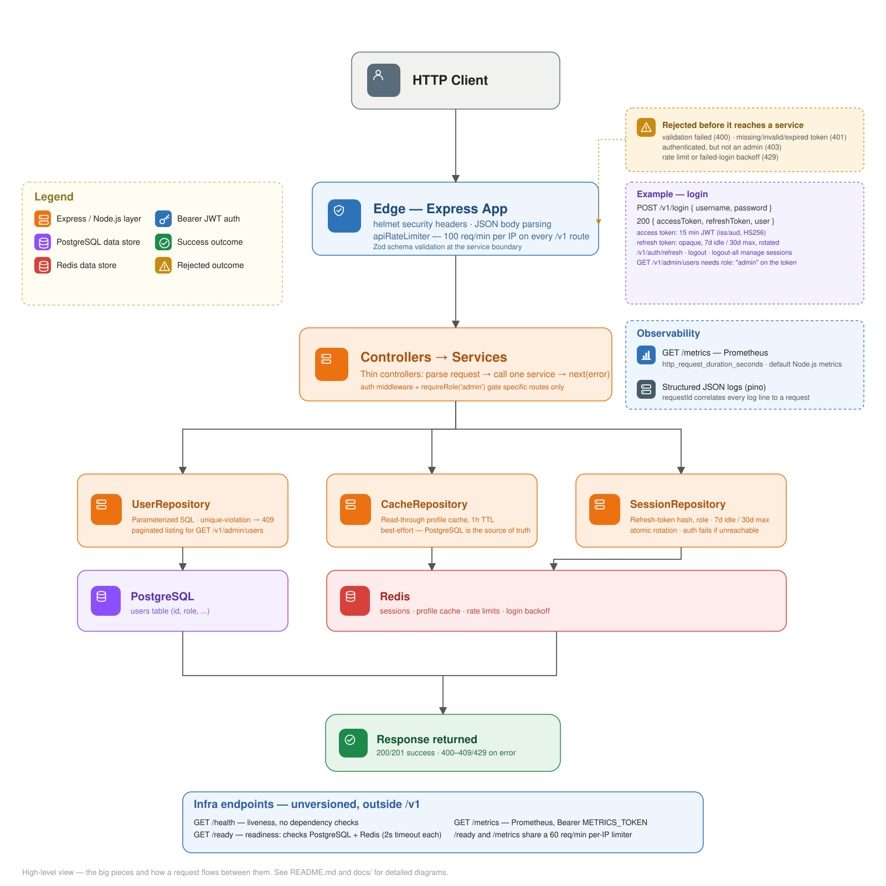

# JWT + Redis Session API

[](https://github.com/luizcurti/node-jwt-redis-session-api/actions/workflows/ci.yml)


[](LICENSE)

A REST API for user registration and authentication: short-lived JWT access tokens backed by server-side sessions in Redis, rotating opaque refresh tokens, and role-based access control. Node.js 24, Express 5, TypeScript, PostgreSQL and Redis.

## Features

- **Instant revocation** — every request checks its session in Redis; logout and "log out everywhere" apply on the next request.
- **Refresh-token rotation** — atomic compare-and-swap, reuse detection, a 30 s grace window for concurrent refreshes, and a 30-day absolute session lifetime.
- **Fresh roles** — each refresh re-reads the user from PostgreSQL; a deleted user loses every session.
- **Brute-force protection** — per-IP limits, per-account progressive backoff on failed logins, constant-time login, per-session refresh limits. All counters live in Redis and hold across replicas.
- **Operations** — Docker (non-root, read-only filesystem, digest-pinned images), Prometheus metrics, liveness/readiness probes, structured logs, graceful shutdown.

## Architecture



Express app → thin controllers → services → repositories → PostgreSQL (users) and Redis (sessions, profile cache, rate limits). See [architecture](docs/architecture.md), [design decisions](docs/design-decisions.md) and the [container topology](docs/img/deployment.svg).

## Requirements

- Docker with Compose, **or**
- Node.js 24+ with PostgreSQL 17 and Redis 7 reachable

## Quick start (Docker)

```bash
git clone https://github.com/luizcurti/node-jwt-redis-session-api.git
cd node-jwt-redis-session-api
cp .env.example .env    # set JWT_SECRET, POSTGRES_PASSWORD, REDIS_PASSWORD, METRICS_TOKEN
docker compose up --build
```

API at <http://localhost:3000>, Swagger UI at <http://localhost:3000/docs>, readiness at <http://localhost:3000/ready>.

## Local development

```bash
npm install
docker compose up -d postgres redis   # or your own PostgreSQL + Redis
npm run migrate
npm run dev                           # hot reload
```

`npm run build && npm start` runs the compiled server as in production.

## Environment variables

| Variable            | Required       | Purpose                                         |
| ------------------- | -------------- | ----------------------------------------------- |
| `JWT_SECRET`        | yes            | HS256 signing key, at least 32 characters       |
| `POSTGRES_PASSWORD` | yes (Compose)  | PostgreSQL password                             |
| `REDIS_PASSWORD`    | yes (Compose)  | Redis password                                  |
| `METRICS_TOKEN`     | recommended    | Bearer token for `/metrics`                     |
| `TRUST_PROXY`       | behind a proxy | Proxy hops or subnets trusted for the client IP |

Full list with defaults: [docs/configuration.md](docs/configuration.md).

## Commands

| Command                    | What it does                                                     |
| -------------------------- | ---------------------------------------------------------------- |
| `npm run lint`             | ESLint + Prettier rules                                          |
| `npm run format:check`     | Prettier check (`npm run format` to fix)                         |
| `npm run typecheck`        | `tsc --noEmit` (strict)                                          |
| `npm run build`            | Compile to `dist/`                                               |
| `npm test`                 | Unit tests, no infrastructure needed                             |
| `npm run test:integration` | Integration tests against PostgreSQL + Redis                     |
| `npm run test:e2e`         | End-to-end HTTP tests against PostgreSQL + Redis                 |
| `npm run coverage:all`     | All Jest tiers with coverage                                     |
| `npm run test:collection`  | Postman collection via Newman against a running instance         |
| `npm run audit`            | Fail on high/critical vulnerabilities in production dependencies |

Test tiers, setup and notable cases: [docs/testing.md](docs/testing.md).

## API

| Method | Endpoint              | Auth           | Description                        |
| ------ | --------------------- | -------------- | ---------------------------------- |
| POST   | `/v1/users`           | —              | Create a user                      |
| POST   | `/v1/login`           | —              | Authenticate, issue tokens         |
| POST   | `/v1/auth/refresh`    | Refresh token  | Rotate the token pair              |
| POST   | `/v1/auth/logout`     | Bearer         | Revoke the current session         |
| POST   | `/v1/auth/logout-all` | Bearer         | Revoke every session of the caller |
| GET    | `/v1/users/me`        | Bearer         | The caller's profile               |
| GET    | `/v1/admin/users`     | Bearer (admin) | List users, paginated              |
| GET    | `/health` · `/ready`  | —              | Liveness · readiness               |
| GET    | `/metrics`            | Metrics token  | Prometheus metrics                 |

Bodies, status codes and sequence diagrams: [docs/api.md](docs/api.md). OpenAPI at `/docs`.

## CI

GitHub Actions on every push and pull request to `main`:

- **lint-and-test** — dependency audit, ESLint, Prettier, typecheck, unit + integration + e2e tests with coverage (PostgreSQL and Redis service containers), build.
- **docker-validation** — builds the image, scans it with Trivy (fails on fixable HIGH/CRITICAL), starts the Compose stack, waits for `/ready`, runs the Postman collection.
- **codeql** — static analysis.

## Documentation

| Document                                        | Contents                                                       |
| ----------------------------------------------- | -------------------------------------------------------------- |
| [api.md](docs/api.md)                           | Endpoints, status codes, sequence diagrams                     |
| [design-decisions.md](docs/design-decisions.md) | Key design decisions and their trade-offs                      |
| [security.md](docs/security.md)                 | Session lifecycle, rotation, brute-force protection, hardening |
| [architecture.md](docs/architecture.md)         | Layering, database schema, migrations                          |
| [configuration.md](docs/configuration.md)       | All environment variables                                      |
| [observability.md](docs/observability.md)       | Logs, probes, metrics, graceful shutdown                       |
| [testing.md](docs/testing.md)                   | Test tiers, how to run them, notable cases                     |
| [technical-notes.md](docs/technical-notes.md)   | Toolchain, Docker image, ports, scaling                        |
| [docs/README.md](docs/README.md)                | Diagram sources and how to render them                         |

## License

MIT — see [LICENSE](LICENSE).
