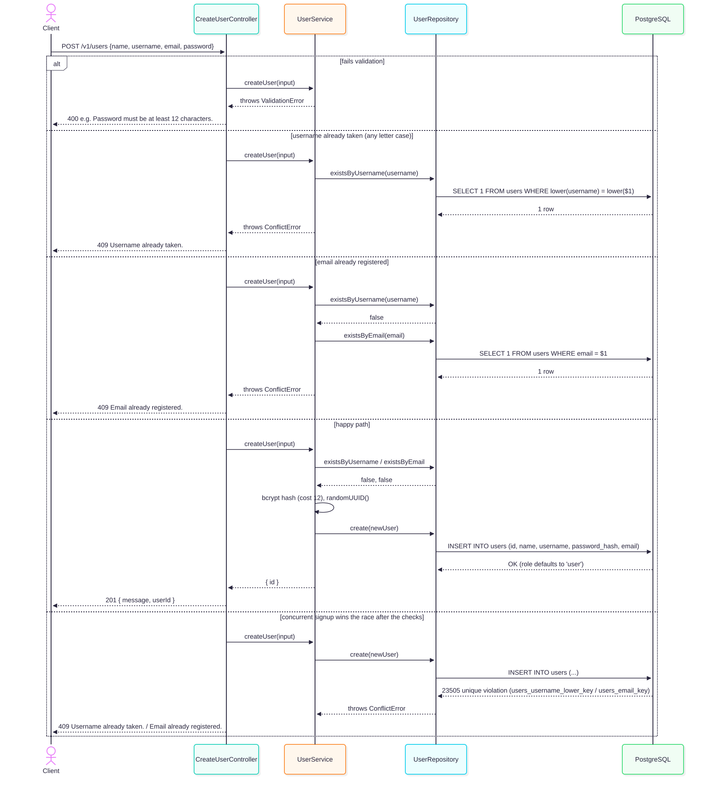
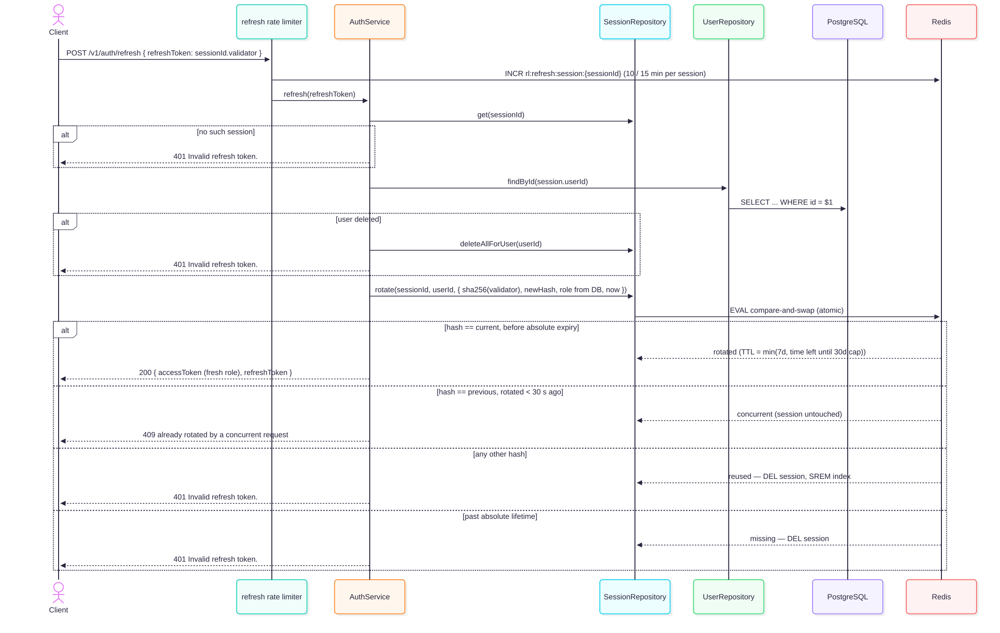

# API Reference

Interactive OpenAPI docs are served at **`/docs`** when the server is running. Every business endpoint lives under `/v1`; `/`, `/health`, `/ready`, `/metrics`, and `/docs` are deliberately unversioned infra/meta endpoints.

| Method | Endpoint              | Auth           | Description                                   |
| ------ | --------------------- | -------------- | --------------------------------------------- |
| POST   | `/v1/users`           | —              | Create a user                                 |
| POST   | `/v1/login`           | —              | Authenticate, issue tokens                    |
| POST   | `/v1/auth/refresh`    | Refresh token  | Rotate the access/refresh token pair          |
| POST   | `/v1/auth/logout`     | Bearer         | Revoke the current session                    |
| POST   | `/v1/auth/logout-all` | Bearer         | Revoke every session of the caller            |
| GET    | `/v1/users/me`        | Bearer         | Get the caller's own profile                  |
| GET    | `/v1/admin/users`     | Bearer (admin) | List users, paginated                         |
| GET    | `/health`             | —              | Liveness probe                                |
| GET    | `/ready`              | —              | Readiness probe (PostgreSQL + Redis)          |
| GET    | `/metrics`            | Metrics token  | Prometheus metrics                            |

Every `/v1` route can also answer `429 { "error": "Too many requests. Please try again later." }` (100 requests/min per IP) and `500 { "error": "Internal server error." }`; those aren't repeated below.

---

## `POST /v1/users` — Create a user



```json
{
  "name": "New User",
  "username": "newuser",
  "email": "newuser@example.com",
  "password": "a-strong-password-123"
}
```

Validated with [Zod](https://zod.dev) (`src/services/UserService.ts`):

| Field      | Rule                                                                                                                             |
| ---------- | -------------------------------------------------------------------------------------------------------------------------------- |
| `username` | 3–30 characters, trimmed; unique **case-insensitively** (`Luiz` and `luiz` are the same account)                                 |
| `name`     | 2–100 characters, trimmed                                                                                                        |
| `email`    | valid email, trimmed, lowercased before storage and uniqueness checks                                                           |
| `password` | 12–72 characters — capped at 72 because bcrypt silently truncates anything longer, which would make the extra characters meaningless |

| Status | Body                                                                                                         |
| ------ | ------------------------------------------------------------------------------------------------------------ |
| `201`  | `{ "message": "User created successfully", "userId": "<uuid>" }`                                             |
| `400`  | `{ "error": "..." }` — the first failing field, e.g. `"Password must be at least 12 characters."`            |
| `409`  | `{ "error": "Username already taken." }` or `{ "error": "Email already registered." }`                       |

The service checks `existsByUsername`/`existsByEmail` first for a friendly `409` in the common case, but that check-then-insert has a race window. The real guarantee is the database: a unique index on `lower(username)` and a unique constraint on `email`. `UserRepository.create` translates Postgres's unique-violation (`23505`) into the same `ConflictError`, so two concurrent signups for one username still resolve to a clean `409`. See [architecture.md](architecture.md#database-schema).

---

## `POST /v1/login` — Authenticate


```json
{
  "username": "newuser",
  "password": "a-strong-password-123"
}
```

| Status | Body                                                                                                                                                                  |
| ------ | --------------------------------------------------------------------------------------------------------------------------------------------------------------------- |
| `200`  | `{ "message": "Login successful", "accessToken": "<jwt, 15 min>", "refreshToken": "<sessionId>.<validator>", "user": { "id", "name", "username", "email", "role" } }` |
| `400`  | `{ "error": "Username and password are required." }`                                                                                                                  |
| `401`  | `{ "error": "Invalid credentials." }` — identical, and equally slow, for an unknown username and a wrong password                                                      |
| `429`  | `{ "error": "Too many login attempts. Please try again later." }` — more than 20 requests / 15 min from this IP                                                       |
| `429`  | `{ "error": "Too many failed login attempts for this account. Please try again later." }` + `Retry-After` — the account is in its failed-login backoff               |

The username matches in any letter case. Only **failed** logins count toward the per-account backoff: 5 are free within 15 minutes, then each further failure imposes 1 s, 2 s, 4 s, … (capped at 15 min). A successful login resets it. See [security.md](security.md#login-brute-force-protection).

---

## `POST /v1/auth/refresh` — Rotate the token pair



```json
{ "refreshToken": "<sessionId>.<validator>" }
```

| Status | Body                                                                                                                                       |
| ------ | ------------------------------------------------------------------------------------------------------------------------------------------ |
| `200`  | `{ "message": "Token refreshed successfully", "accessToken": "<jwt>", "refreshToken": "<sessionId>.<new validator>" }`                     |
| `400`  | `{ "error": "Refresh token is required." }`                                                                                                |
| `401`  | `{ "error": "Invalid refresh token." }` — malformed, unknown, past its lifetime, reused (which deletes the session), or the user was deleted |
| `409`  | `{ "error": "Refresh token was already rotated by a concurrent request." }` — see below                                                    |
| `429`  | `{ "error": "Too many refresh attempts. Please try again later." }` — more than 10 / 15 min **for this session**                            |

- The returned refresh token replaces the one sent; the old one stops working immediately.
- The new access token carries the role **freshly read from PostgreSQL**, so a promotion or demotion takes effect at the next refresh.
- A session can be refreshed for at most **30 days after login**, however often it's refreshed; after 7 days without a refresh it expires on its own.
- **`409` is recoverable.** It means another request (e.g. a second browser tab) rotated this token less than 30 s ago. The session is still alive: read the newest refresh token from wherever the client stores it and retry. Replaying an old token after that window is treated as theft, and the whole session is deleted.

---

## `POST /v1/auth/logout` — Revoke the current session

Header: `Authorization: Bearer <accessToken>`

| Status | Body                                                                                                           |
| ------ | -------------------------------------------------------------------------------------------------------------- |
| `200`  | `{ "message": "Logout successful" }`                                                                           |
| `401`  | `{ "error": "Token missing" }`, `{ "error": "Invalid token" }`, or `{ "error": "Session expired or revoked" }` |

Deletes the session from Redis. The access token used for this call — and every other one issued for the same session — is rejected on its next use, even though it hasn't expired.

---

## `POST /v1/auth/logout-all` — Revoke every session of the caller

Header: `Authorization: Bearer <accessToken>`

| Status | Body                                                                                                           |
| ------ | -------------------------------------------------------------------------------------------------------------- |
| `200`  | `{ "message": "Logged out of all sessions", "revokedSessions": 2 }`                                            |
| `401`  | `{ "error": "Token missing" }`, `{ "error": "Invalid token" }`, or `{ "error": "Session expired or revoked" }` |

"Log out everywhere": every session of the user on every device, via the per-user session index in Redis. Other users are unaffected.

---

## `GET /v1/users/me` — The caller's own profile


Header: `Authorization: Bearer <accessToken>`

| Status | Body                                                                                                           |
| ------ | -------------------------------------------------------------------------------------------------------------- |
| `200`  | `{ "id", "name", "username", "email", "role" }`                                                                |
| `401`  | `{ "error": "Token missing" }`, `{ "error": "Invalid token" }`, or `{ "error": "Session expired or revoked" }` |
| `404`  | `{ "error": "User not found." }` — the account doesn't exist in PostgreSQL                                     |

The user id comes from the authenticated session, not the URL, so there's no id to tamper with and nothing to answer `403` to. True read-through cache: a Redis hit returns the profile without touching PostgreSQL; a miss (expired, never populated, corrupted, or Redis down) falls back to PostgreSQL and repopulates the cache on a best-effort basis. Redis being down degrades this endpoint's latency, not its availability.

---

## `GET /v1/admin/users` — List users (admin only)

Header: `Authorization: Bearer <accessToken>` with `role: "admin"`.

| Param    | Default | Range |
| -------- | ------- | ----- |
| `limit`  | 20      | 1–100 |
| `offset` | 0       | 0+    |

| Status | Body                                                                                           |
| ------ | ---------------------------------------------------------------------------------------------- |
| `200`  | `{ "items": [{ "id", "name", "username", "email", "role" }, ...], "total", "limit", "offset" }` |
| `400`  | `{ "error": "limit must be a number." }` (or the equivalent for the failing param/rule)        |
| `401`  | Missing, invalid, or revoked token                                                             |
| `403`  | `{ "error": "You do not have access to this resource." }` — authenticated, but not an admin    |

Ordered by creation time, then id — a total order, so offset pages never repeat or skip a row.

Becoming an admin is deliberately not self-service: the signup schema has no `role` field and `UserRepository.create`'s `INSERT` has no `role` column, so no request body can influence it. Promote with SQL:

```sql
UPDATE users SET role = 'admin' WHERE lower(username) = lower('your-username');
```

The new role reaches the user's next access token at their next refresh (≤ 15 minutes) — or immediately, if their sessions are revoked with `logout-all` and they log in again.

---

## `GET /health`, `GET /ready`, `GET /metrics`

| Endpoint       | `200`                                 | Other                                                                                                 |
| -------------- | ------------------------------------- | ----------------------------------------------------------------------------------------------------- |
| `GET /health`  | `{ "status": "ok" }`                  | Never anything else — no dependency checks, not rate-limited                                          |
| `GET /ready`   | `{ "postgres": "ok", "redis": "ok" }` | `503` with `"error"` for the failing dependency; `429` over 60 req/min per IP                         |
| `GET /metrics` | Prometheus text format                | `401` without `Authorization: Bearer <METRICS_TOKEN>`; `404` in production with no token configured; `429` over 60 req/min |

See [observability.md](observability.md).
